# 설계 — 맵 에디터 · 비교화면 제로베이스 재디자인

> 브랜치 `feat/editor-compare-redesign` (main 미머지). 작성 2026-06-28.
> 마스터 트래커는 후속 `SCREEN-REDESIGN-EDITOR.md`(구현계획에서 생성), 커밋 로그는 `PROGRESS.md`.
> 참고 목업: `docs/superpowers/specs/assets/editor-compare-redesign/` (18장).

## 1. 한 줄 요약

맵 **에디터 화면**과 **버전 비교화면**을 hifi 목업 기준으로 **제로베이스 재구현**한다. 가장 위험한 **캔버스 엔진(React Flow·드래그/드롭존·좌표·스코프·dagre)은 검증된 채로 재사용**하고, 그 위의 UI 크롬(레이아웃·4탭 인스펙터·모달·오버레이·컨텍스트 메뉴·그룹·비교 패널)을 전부 새로 짠다. **모달 단위로 하나씩 구현→검토→커밋**하며, 구 에디터(:3100 OLD)와 대조해 전 기능 연결을 확인한 뒤 컷오버한다.

## 2. 목표 / 비목표

**목표**
- 목업 18장의 IA를 기존 컴포넌트·디자인 토큰으로 재현(우측 4탭 인스펙터 통합, 컨텍스트 메뉴 5종, 노드 편집 모달, 드롭존, AI 채팅 패널, 비교화면).
- 백엔드·데이터모델·캔버스 엔진을 그대로 재사용 — 프론트 UI 레이어만 교체.
- 각 단위가 독립 커밋·독립 검토 가능. 앱이 항상 동작(빌드 중에도 구 에디터 유지).

**비목표 (이번 범위 밖)**
- 드롭존 8방향 중 **4 추후 확장**(현행 4방향 유지).
- 백엔드/DB 스키마 변경(갭 발견 시 작업 전 사용자 확인).
- 비교화면 "To-Be 적용"의 병합/복제 동작 — 이번엔 **에디터로 내비게이션**만.
- 서버 docker-compose 배포 검증(머지 전 별도 단계).

## 3. 확정 결정 (사용자 승인)

| # | 결정 | 값 |
|---|------|-----|
| D1 | 구축·컷오버 전략 | **병렬 신규 에디터(`/v2` 임시 라우트) + 패리티 후 컷오버**. 구 에디터·:3100 OLD는 참조로 유지 |
| D2 | 캔버스 엔진 범위 | **검증된 엔진 재사용** + 나머지 제로베이스 |
| D3 | AI 어시스턴트 | **이번 범위에 실연결** (AI 채팅 패널 재구현) |
| D4 | 비교화면 "To-Be 적용" | **에디터로 이동(단순 내비)** — 백엔드 무변경 |
| D5 | 구현 순서 | **에디터 먼저 → 비교 나중**(노드렌더·diff 라이브 재사용) |

## 4. 아키텍처

### 4.1 재사용 경계 — 손대지 않는 "엔진"
- React Flow 셋업 + `ProcessNode` 렌더러(디자인 토큰 미세 재스타일만 — E3 테두리색·E4 셀렉션 링).
- 드래그/이동·충돌 회피·**드롭존(4방향)**·엣지 연결(`onConnect`/`isValidConnection`)·좌표↔스코프 변환·**하위프로세스 읽기전용 임베드/아웃라인 펼침**·dagre 자동정렬.
- 공유 라이브러리: `lib/canvas.ts`(타입·헬퍼·dagre·충돌·아웃라인), `lib/diff.ts`·`lib/merge-diff.ts`(`buildMergedGraph`), `lib/api.ts`(40+ 엔드포인트), `lib/id.ts`(`genId`), `lib/i18n-messages.ts`.
- **백엔드·DB 무변경 전제.**

### 4.2 제로베이스로 새로 짜는 것
- 에디터 셸 레이아웃: 상단바 · 좌측 사이드바 · 캔버스 프레임 · 우측 인스펙터.
- **4탭 인스펙터**(속성/맵/승인/활동) + 각 탭 콘텐츠.
- 모달·오버레이·컨텍스트 메뉴 전종 · 그룹(박스/타이틀바/일괄편집) · AI 채팅 패널.
- 비교화면 크롬(BASE/TARGET 셀렉터 · 범례 · 변경목록 패널 · 액션) — diff 라이브는 재사용.

### 4.3 코드 위치 & 컷오버
- 신규 코드: `frontend/src/components/editor-v2/` (셸·탭·모달·오버레이·그룹·AI). 공유 `lib/*` 재사용.
- 빌드 중: 신규 에디터를 **임시 라우트 `frontend/src/app/maps/[mapId]/v2/page.tsx`** 로, 비교 신화면은 `…/v2/compare/page.tsx`. 구 에디터는 `/maps/[mapId]`에 그대로.
- **컷오버**: 패리티 달성 시 v2 코드를 `page.tsx`·`compare/page.tsx`로 승격, 구 에디터·구 전용 컴포넌트·`/v2` 라우트 삭제. (구 OLD는 :3100 main 워크트리로 계속 참조 가능.)
- **dev 갤러리**: `frontend/src/app/dev/editor-gallery/page.tsx` — 모달/오버레이를 고립 나열(배선 전 룩 검토용). 컷오버 시 삭제 또는 dev 전용 유지.

### 4.4 데이터 흐름 & 상태 모델
- 신규 셸이 그래프 state(노드/엣지/그룹·버전·선택·스코프)를 보유하되, 영속·도메인 로직은 전부 기존 `lib/api.ts`·`lib/canvas.ts`·`diff/merge` 호출.
- 큰 상태는 **메인 state 오염 금지**(lessons `react-ts-patterns`) — 자식 노드·드래그 라이브·풀그래프는 별도 state/ref 미러. `useCallback` deps TDZ는 ref 미러로 회피.
- 자식 스코프 저장은 `getGraph→변형→PUT`(그룹 보존), fullGraph 낙관적 갱신(lessons `scope-save-and-coordinates`).

## 5. 작업 제약 (전 단위 공통)
- 줄바꿈 **LF 고정** · id는 **`genId()`**(`crypto.randomUUID` 금지) · 색은 **디자인 토큰만**(raw hex 금지, 단 노드 `color`·`COLOR_PRESETS`·PNG 배경은 데이터/출력 예외).
- **UI 영어 / 동적 데이터·주석 한글** · 아이콘 Lucide 16px strokeWidth 1.5 · 이모지 금지.
- 버튼 인터랙션(커서·클릭 눌림)은 전역 base — 컴포넌트엔 hover 배경만.
- **리팩터로 UI 옮길 때 호버 힌트·툴팁 등 부수 동작 유실 금지**(메모리 `refactor-preserve-secondary-behaviors`).
- 각 단위: `tsc`/`eslint` 0 + `/v2` 라이브 + **:3100 OLD 동작 대조** + 단위 커밋.
- **백엔드/DB 스키마 변경은 작업 전 사용자 확인**.

## 6. 구현 단위 인벤토리 (모달 단위 · 구현 순서)

> 각 `U`가 한 검토 단위. "검증"은 그 단위의 수용 기준. 이미지는 `assets/editor-compare-redesign/`.

### 전체 컨텍스트
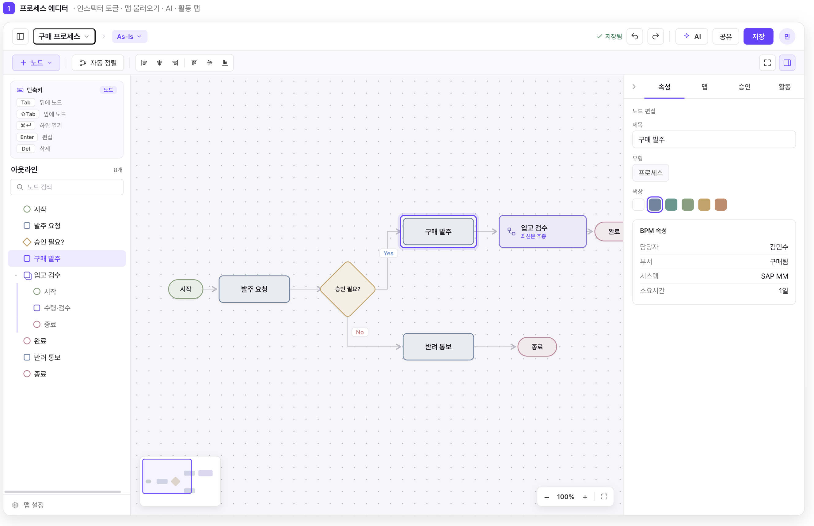

### Phase 0 — 스캐폴드
- **U0.1 셸 골격 + 데이터 로드** — `/v2` 라우트, `editor-v2/` 셸(상단/좌/캔버스/우 placeholder 영역), map·version·graph 로드 배선, dev 갤러리 라우트 스텁.
  - 검증: `/maps/{id}/v2` 로드, 콘솔 에러 0, 4영역 골격 렌더.

### Phase 1 — 캔버스 (엔진 재사용, 새 프레임)
- **U1.1 캔버스 읽기 렌더** — React Flow 마운트 + 기존 `ProcessNode`로 노드/엣지/그룹 표시, dot-grid 배경, 미니맵(좌하), 줌 pill(`- 100% +` 우하·전체화면).
  - 검증: 데모 맵이 :3100과 동일 그래프로 렌더.
- **U1.2 노드 비주얼 토큰 재스타일** — E3 테두리(`#6e84a3`)·E4 셀렉션 링(`2px accent + 4px color-mix 12%`)·분기 마름모·시작/끝 알약·색 fill(`color-mix 18%`)·표시정보(담당자/부서/시스템/소요시간) 토글 반영.
  - 검증: 5 노드 유형·선택 링·색 프리셋 시각 확인.
- **U1.3 인터랙션 배선** — 노드/엣지 선택·팬/줌·드래그 이동(엔진 충돌 재사용)·엣지 연결(`onConnect`+`isValidConnection`+`hasReciprocalEdge`).
  - 검증: 드래그/연결/역방향금지/터미널룰 :3100 대조.
- **U1.4 드롭존 라디얼 링** — 4방향(← 앞에·→ 뒤에·▲ 그룹·▼ 스왑) + "이미 연결됨 → 유지/중간삽입" 프롬프트. (8방향 표기 중 4 추후는 비활성 자리만.)
  - 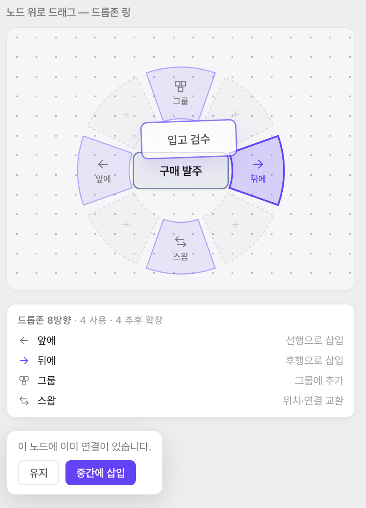
  - 검증: 노드 위로 드래그 시 링 표기·각 방향 동작·연결 프롬프트 :3100 대조.

### Phase 2 — 상단바 + 좌측 사이드바
- **U2.1 상단바** — 앱명·브레드크럼(맵명·버전 pill)·저장상태("저장됨")·undo/redo·＋/AI/공유/저장·전체화면/인스펙터 토글. undo·redo·저장·자동저장 배선.
  - 검증: undo/redo·수동저장·자동저장(dirty)·토글 동작.
- **U2.2 맵네임 드롭다운** — 검색("다른 맵 불러오기")·최근 리스트(아이콘·라벨·버전·수정시각·현재 체크)·＋ 새 맵 만들기.
  - 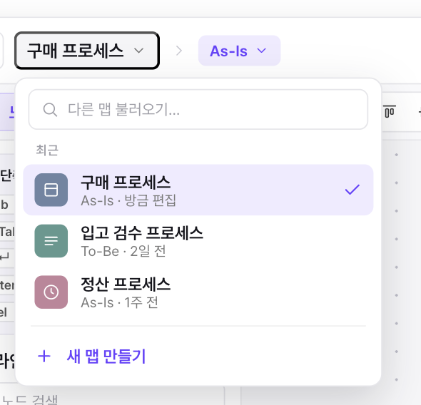
  - 검증: 최근 맵 목록·검색·이동·새 맵 생성.
- **U2.3 버전 pill 드롭다운** — As-Is 등 버전 전환(현재 표시·전환 시 그래프 리로드).
  - 검증: 버전 전환 시 캔버스/인스펙터 갱신.
- **U2.4 ＋노드 버튼 + 메뉴** — 모양 선택(프로세스/분기(판단)/시작·끝/하위 프로세스=라이브러리 연결) + 자동정렬 버튼 + 정렬도구(좌/중앙/상/중앙·가로·세로 등간격).
  - 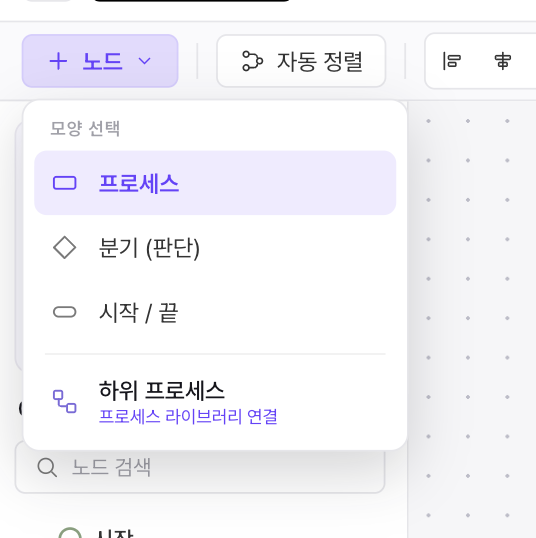
  - 검증: 각 유형 노드 생성·정렬도구 동작.
- **U2.5 사이드바 본문** — 단축키 카드(선택 맥락 반응 — 노드/분기/엣지/무선택, I6)·노드 검색·아웃라인 트리(하위프로세스 중첩 펼침·검색 필터)·맵 설정 링크.
  - 검증: 아웃라인 클릭→포커스·검색·단축키 카드 맥락 전환.

### Phase 3 — 우측 인스펙터 (4탭)
- **U3.1 탭 바 + 접기/폭** — 탭(속성/맵/승인/활동)·접힘 시 우측 가장자리 재오픈 탭·폭(330)·전체화면/패널 토글 아이콘.
  - 검증: 탭 전환·접기/펼치기·폭 유지.
- **U3.2 속성탭 빈상태** — "선택된 항목 없음" + ＋노드추가(N)·라이브러리에서 추가·자동정렬 + 맵 요약(노드/엣지/하위프로세스/마지막 저장).
  - 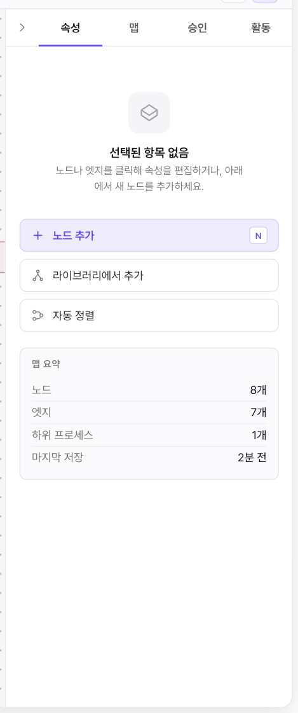
  - 검증: 무선택 시 표시·맵 요약 수치 일치·버튼 동작.
- **U3.3 속성탭 노드 선택** — 노드 편집(제목·유형[프로세스/분기(판단)]·색상 스와치·BPM 속성[담당자/부서/시스템/소요시간]).
  - 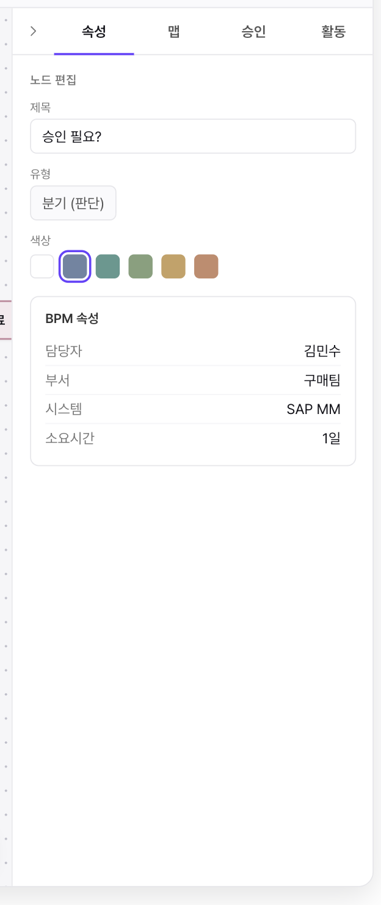
  - 검증: 제목/색/속성 편집→캔버스 반영·저장.
- **U3.4 속성탭 엣지 선택** — 엣지 편집(source→target·분기 라벨[Yes/No/기타 세그]·라벨 입력·연결 면[오른쪽→왼쪽·꺾은선]·엣지 삭제).
  - 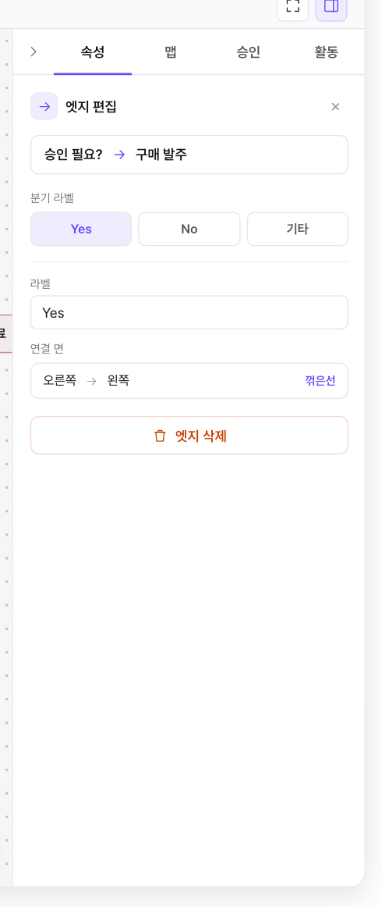
  - 검증: 분기/라벨/연결면 변경·삭제 :3100 대조.
- **U3.5 맵 탭** — 가시성(공개/비공개 세그)·소유자 카드·협업자 리스트(롤 pill Editor/Viewer·부서 카드)·설명·노드 표시정보 토글(맵 전체)·엣지 스타일 세그(곡선/꺾은선/직선·맵 전체 일괄)·PNG 다운로드.
  - 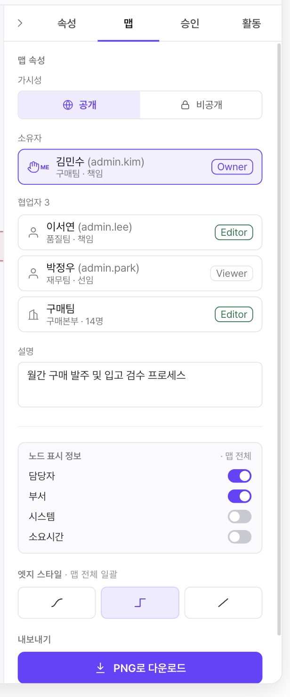
  - 검증: 가시성/표시정보/엣지스타일/PNG 동작·권한 게이팅.
- **U3.6 승인 탭** — 워크플로 stepper(제출→검토→게시)·status 배지(검토 대기 등)·승인자 리스트(승인/대기)·승인 요청 보내기. (`WorkflowDashboard`/`ApproverManager` 로직 재사용.)
  - 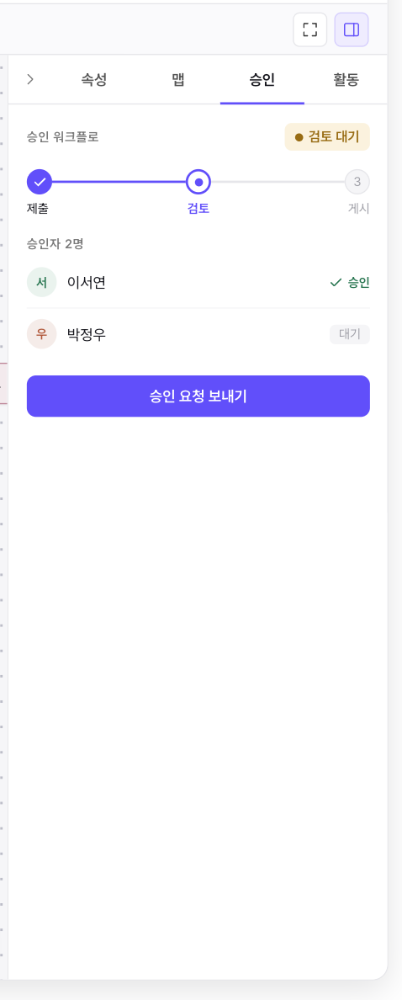
  - 검증: 제출/승인/반려/게시 흐름 :3100 대조.
- **U3.7 활동 탭** — 코멘트(스레드·답글·@멘션·해결/해결됨·미해결 카운트)·코멘트 추가 + 버전 타임라인(현재/검토중/승인됨/게시됨·비교/복원). (`CommentSection`·`version-timeline` 재사용.)
  - 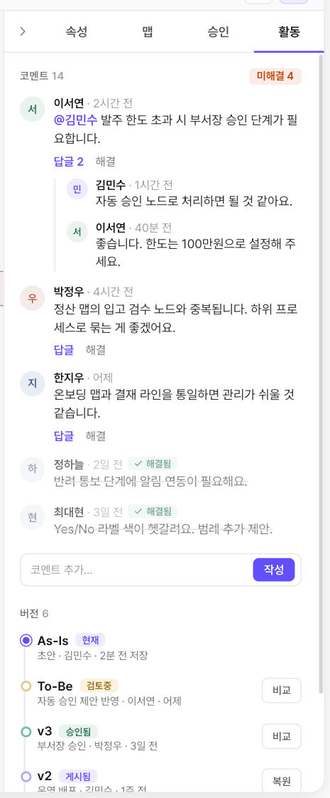
  - 검증: 코멘트 작성/답글/해결·버전 비교 링크·복원.

### Phase 4 — 컨텍스트 메뉴 + 노드 모달
- **U4.1 컨텍스트 인프라 + 캔버스 우클릭** — 위치/외부클릭 닫힘 인프라 + 캔버스(빈영역): 여기에 노드추가(N)·라이브러리에서 추가·정렬·레이아웃 서브메뉴(자동정렬·정렬 4종·가로/세로 등간격)·전체 선택(⌘A)·PNG 내보내기(⌘E).
  - 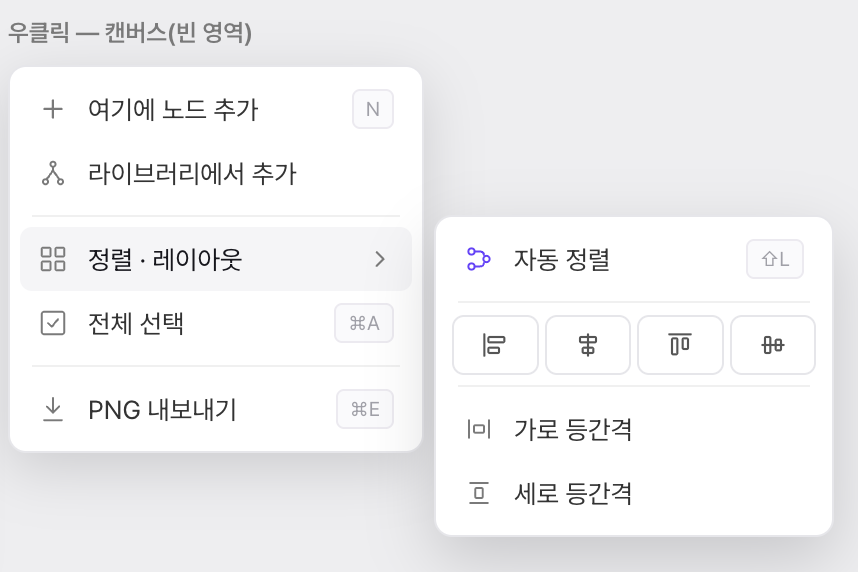
  - 검증: 우클릭 위치·서브메뉴·각 항목·단축키.
- **U4.2 노드 우클릭** — 편집(Enter)·이름 변경(F2)·색상(서브)·앞에 노드추가(⇧Tab)·뒤에 노드추가(Tab)·복제(⌘D)·삭제(Del).
  - 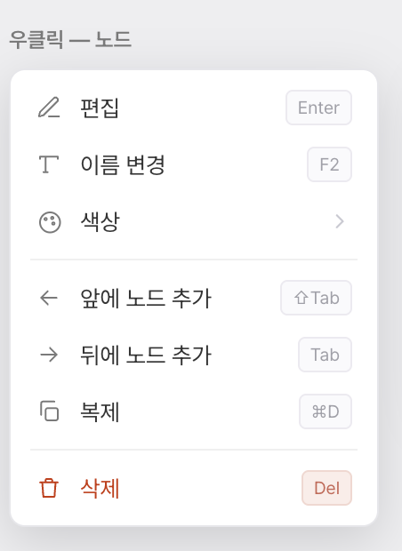
  - 검증: 각 항목·단축키 동작.
- **U4.3 엣지 우클릭 + 분기 엣지** — 엣지: 연결 면(비주얼 picker·source/target 핸들 선택)·라벨 편집·삭제(Del). 분기 엣지: 분기 종류(Yes/No/기타 세그)·라벨.
  - 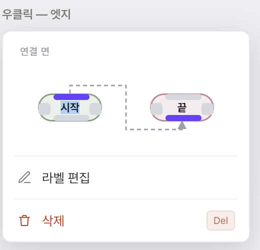 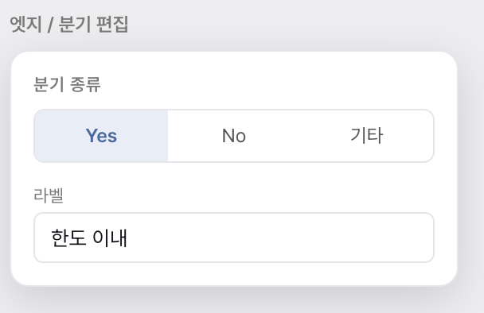
  - 검증: 연결면 변경·분기종류/라벨·삭제.
- **U4.4 노드 더블클릭 편집 모달** — 제목·설명·유형·색상·선행(←)/후행(→) chips·Esc 취소·⌘S 저장·취소/저장 버튼.
  - 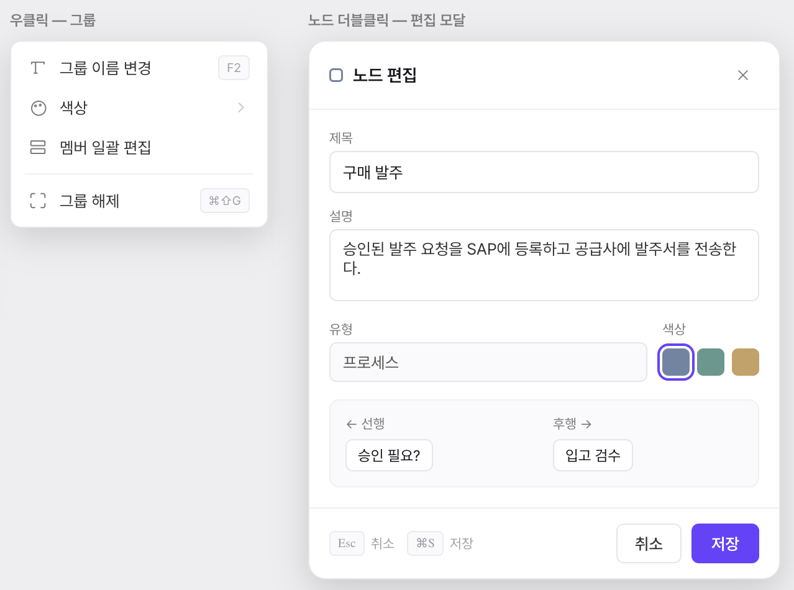 *(우측 모달부)*
  - 검증: 더블클릭 오픈·편집·Esc/⌘S·선행/후행 표시.
- **U4.5 공용 색상 서브메뉴** — 노드/그룹/컨텍스트 공유 색 선택(`COLOR_PRESETS`).
  - 검증: 노드·그룹·컨텍스트에서 색 변경 일관.

### Phase 5 — 캔버스 그룹
- **U5.1 그룹 박스 렌더** — 점선 컨테이너·타이틀바(색·이름·편집 연필)·자식 노드 포함. (엔진 그룹 데이터 재사용.)
  - 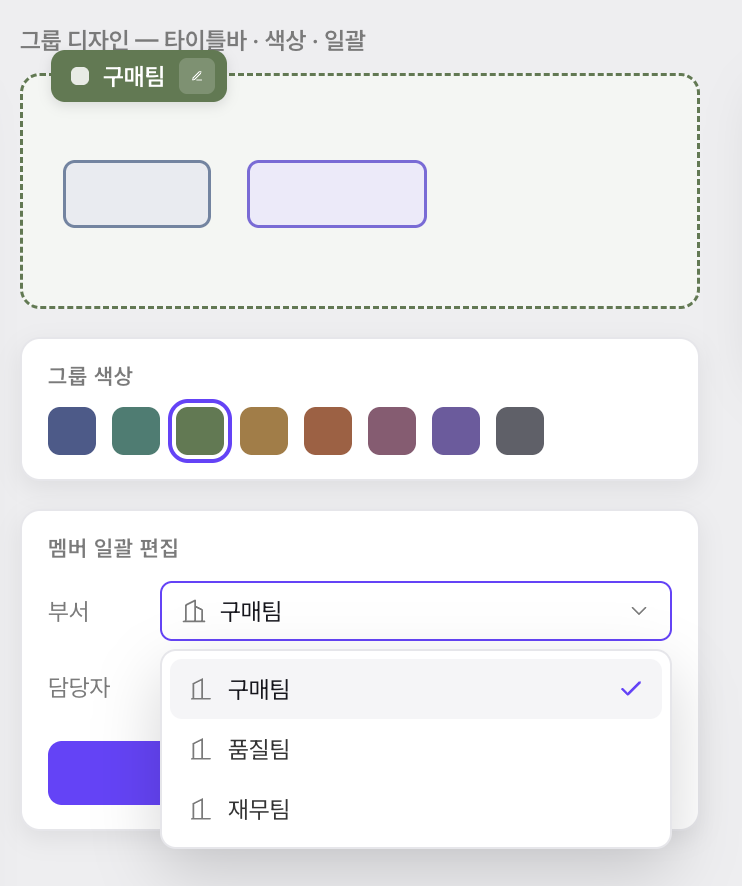
  - 검증: 그룹 박스·타이틀·자식 포함 표시.
- **U5.2 그룹 우클릭** — 그룹 이름 변경(F2)·색상(서브)·멤버 일괄 편집·그룹 해제(⌘⇧G).
  -  *(좌측 메뉴부)*
  - 검증: 이름/색/해제·멤버 일괄 진입.
- **U5.3 그룹 일괄편집 UI** — 타이틀바 인라인 편집·그룹 색상(8 스와치)·멤버 일괄(부서/담당자 드롭다운→일괄 apply).
  - 검증: 그룹 색·멤버 일괄 부서/담당자 적용→자식 노드 반영.

### Phase 6 — 마감 + 컷오버
- **U6.1 AI 채팅 패널 (프로세스 AI)** — 헤더(맵명·As-Is 기준·최소화/닫기)·대화 스레드·**제안 카드(맵에 추가/미리보기)**·퀵칩(프로세스 요약/병목 찾기/To-Be 제안)·입력창. (`AiChatPanel` 재구현·연결.)
  - 
  - 검증: 질의→응답·제안카드 미리보기/맵에 추가가 캔버스 반영.
- **U6.2 라이브러리에서 추가 + 하위프로세스 링크** — `ProcessLibraryPanel` 재구현, 하위프로세스 노드=다른 맵 링크(읽기전용 임베드).
  - 검증: 라이브러리 선택→링크 노드 생성→아웃라인 임베드 펼침.
- **U6.3 읽기전용/잠금 표면화** — 뷰어·체크아웃·비-draft 사유별 읽기전용 스트립·워터마크(V2/V3 패턴 재사용)·체크아웃 잠금 표시.
  - 검증: 뷰어 권한·체크아웃 점유 시 표시 :3100 대조.
- **U6.4 정렬·export 배선 마무리** — 자동정렬(dagre)·정렬도구·PNG export 동작 최종 확인.
  - 검증: 자동정렬·정렬·PNG.
- **U6.5 패리티 스윕 + 컷오버** — :3100 OLD 전 기능 연결 체크리스트 통과 → v2를 `page.tsx`로 승격, 구 코드/`/v2` 삭제.
  - 검증: 체크리스트 100%·`tsc`/`eslint`/`pytest` 0·라이브.

### Phase 7 — 비교화면
- **U7.1 비교 셸** — BASE/TARGET 셀렉터(드롭다운·버전)·swap·내보내기·**To-Be 적용(에디터로 내비)**·범례(추가/삭제/변경 카운트).
  - 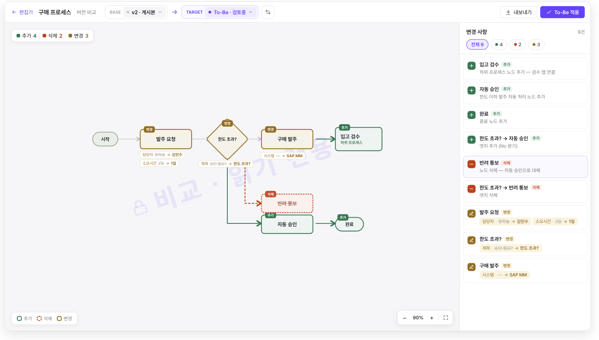
  - 검증: 셀렉터·swap·내비·범례 카운트.
- **U7.2 diff 캔버스** — `buildMergedGraph` 재사용 + 새 `ProcessNode` diff 스타일(추가=green·삭제=red 점선·변경=amber·엣지 색)·dagre 레이아웃·워터마크.
  - 검증: 데모 v2↔To-Be diff 색·노드/엣지 상태 :3100 대조.
- **U7.3 변경사항 패널** — 필터(전체/추가/삭제/변경 카운트)·변경 항목 리스트(아이콘·요약·변경 필드)·클릭→캔버스 포커스.
  - 검증: 필터·항목 클릭 포커스·필드 변화 표기.
- **U7.4 비교 컷오버** — 신규 비교화면을 `compare/page.tsx`로 승격, 구 비교 삭제.
  - 검증: `/maps/{id}/compare` 신화면·라이브.

## 7. 검증 전략
- 단위별: `frontend` `npx tsc --noEmit` 0 · `npx eslint .` 0 → `/v2`(:3000) 브라우저 라이브 → **:3100 OLD 동작 대조**(연결 확인) → 단위 커밋.
- 호버/포커스 전용 UI는 자동화 트리거 불가 → JS로 상태 강제 후 스크린샷(lessons `browser-verification`).
- 컷오버 직전: backend `pytest` 0(무변경 확인)·전 기능 패리티 체크리스트.
- 서버(원격 IP·평문 HTTP) 검증은 머지 전 별도(genId/PKCE 전제).

## 8. 리스크 / 오픈 이슈
- **컷오버 시 라우트 승격**: `/v2`→`page.tsx` 이동 시 내부 링크(`/compare` 등)·구 전용 컴포넌트 의존 정리 필요. 컷오버 단위(U6.5)에서 일괄.
- **AI 제안카드→캔버스 추가**: 노드 추가 API/프리뷰가 캔버스 조작에 의존 → Phase 6 배치로 의존 해소.
- **하위프로세스 임베드**: 엔진 재사용이나 좌표/스코프 함정 잔존 가능 → lessons 선독 필수.
- "To-Be 적용"·드롭존 4 추후 확장은 **차기**(이번 비범위).

## 9. 컷오버 체크리스트 (U6.5에서 사용)
- [ ] 노드 CRUD·드래그·드롭존(4방향)·연결/역방향금지/터미널룰
- [ ] 4탭 인스펙터 전 콘텐츠(속성/맵/승인/활동) 동작
- [ ] 컨텍스트 메뉴 5종·노드 편집 모달·색상 서브메뉴
- [ ] 그룹 박스·우클릭·일괄편집
- [ ] AI 패널·라이브러리/하위프로세스·읽기전용/잠금·자동정렬·PNG
- [ ] 버전 전환·맵 전환·undo/redo·자동저장·체크아웃
- [ ] `tsc`/`eslint`/`pytest` 0 · :3100 전 기능 대조 통과
